# 📰 Everywhere Scrap

<hr/ >

[📑 팀 노션](https://www.notion.so/Everywhere-Scrap-1f1c30dddb9b4cf580a48ed95e8102e1)

### 💡 개요

3시간 간격으로 자동 크롤링되는 알고리즘을 통해 쌓이는 기사 데이터를 활용해 원하는 기사의 키워드 / 3줄 요약 / 워드 클라우드를 확인할 수 있는 서비스

### 💡 기간

2021/01/18 ~ 2021/02/07

### 💡 규칙

| 규칙               | 설명                                    |
| ------------------ | --------------------------------------- |
| Google Meet & ZOOM | PM 02:00 ~ 05:00                        |
| Commit Name        | date_to_do (ex : 0126_login_and_signup) |
| Git 활용           | 각자 branch 만들어서 1일 1 push         |

### 💡 팀원 정보 및 역할 분담

| 팀원   | 역할                                                         |
| ------ | ------------------------------------------------------------ |
| 김준기 | 회원 기능 / 카테고리별 기사 크롤링 / 기사 키워드 ＊ 3줄 요약 * 워드 클라우드 생성 및 조회 |
| 정다솜 | 기사 데이터 조회 / JWT / 비밀번호 암호화(Spring Security) / 기사 찜 하기 / 전체적인 UI/UX |

### 💡 DB 구조

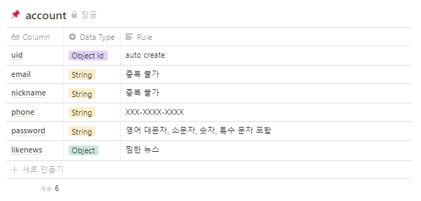

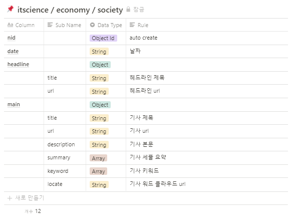

### 💡 개발 환경

##### server

* Spring Boot 2.4.2
* Java 11
* jjwt 0.9.0
* spring security

##### client

-  axios 0.21.1
-  vue 2.6.11
-  vue-cli 2.9.6
-  vue-cookies 1.7.4
-  vue-router 3.4.9
-  jw-vue-pagination 1.0.3
-  sweetalert2 10.14.0

##### Data

* MongoDB
* pymongo
* Python 3.7.3
* selenium
* sklearn
* numpy

### 💡 일정

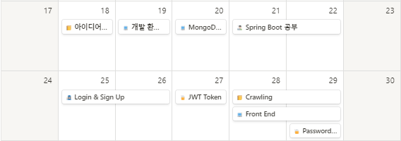

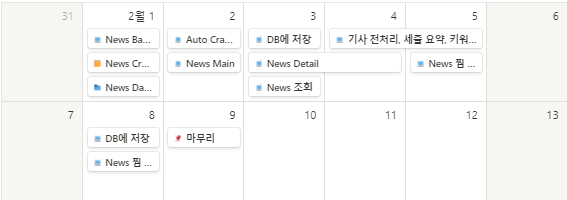

### 💡 REST API

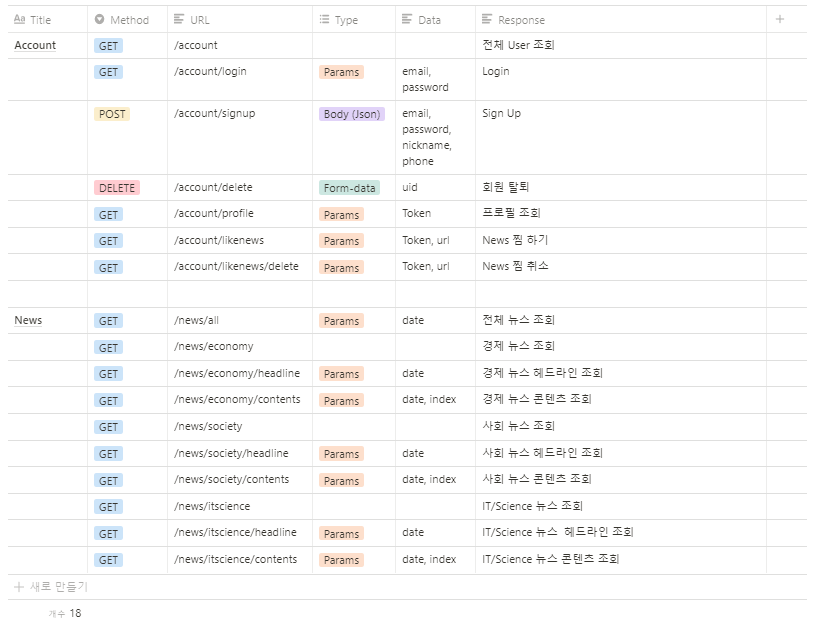

### 💡 UI / UX

##### Main

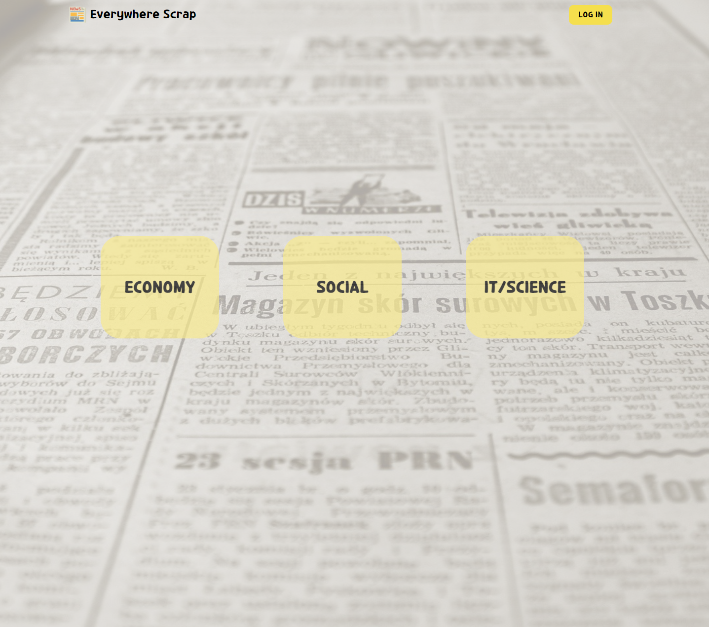

##### Log In

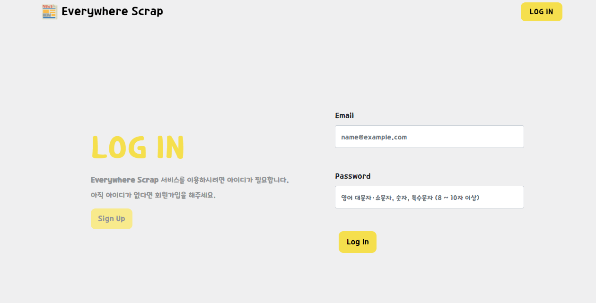

##### Sign Up

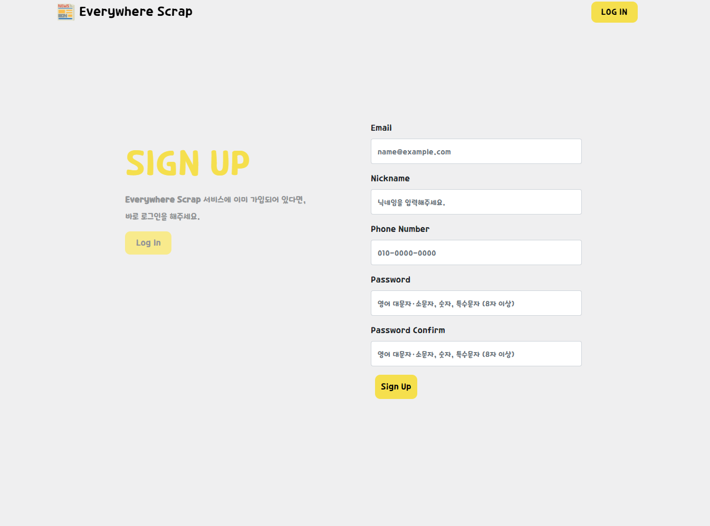

##### Profile

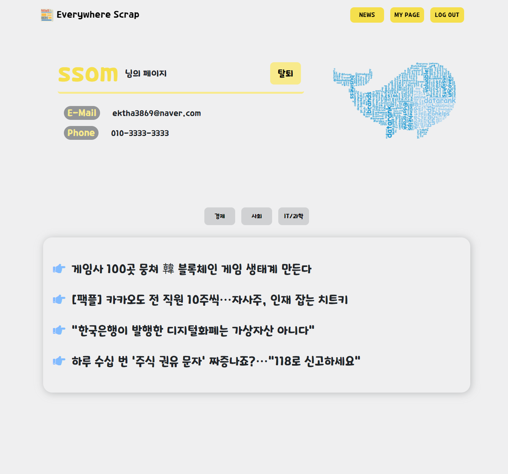

##### News Main

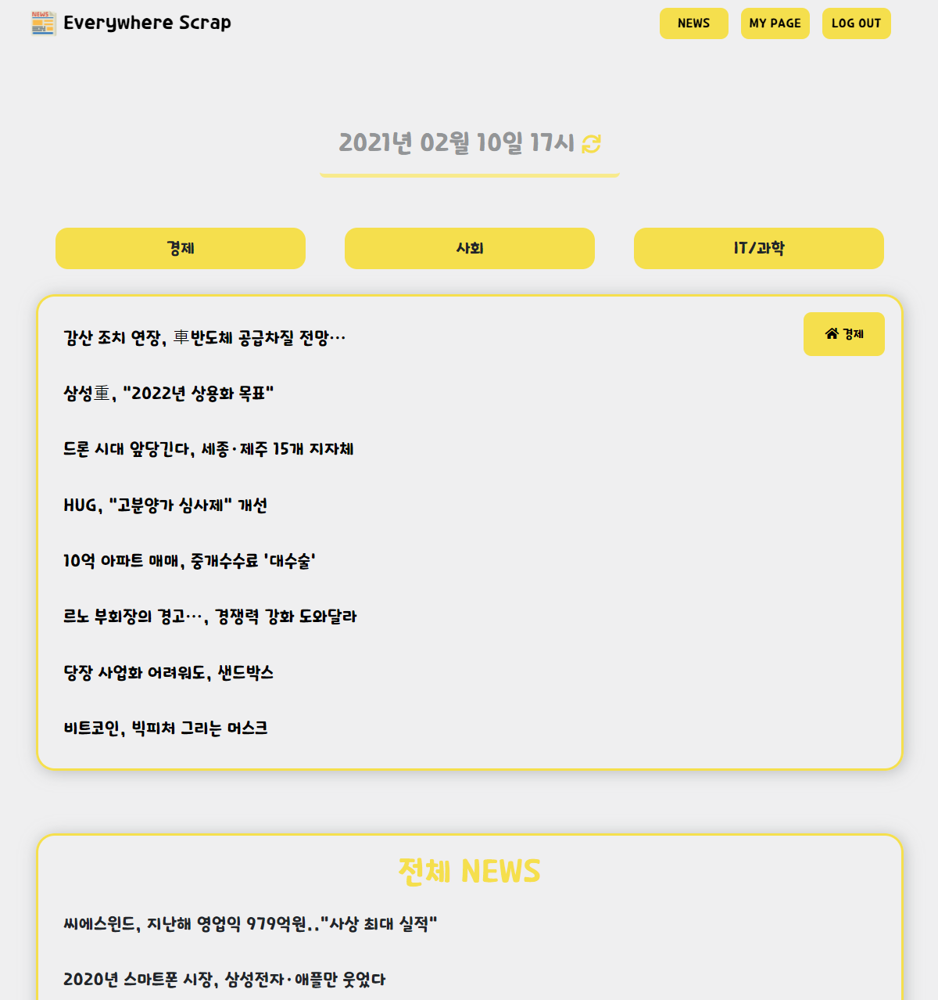

##### News Category

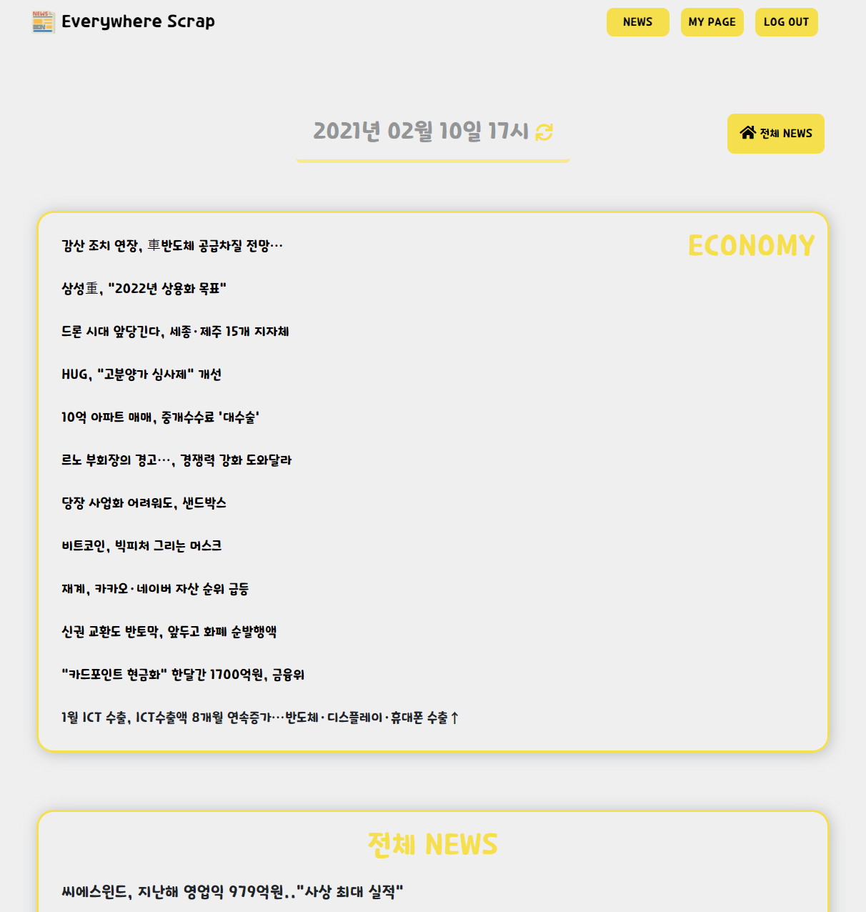

##### News Detail

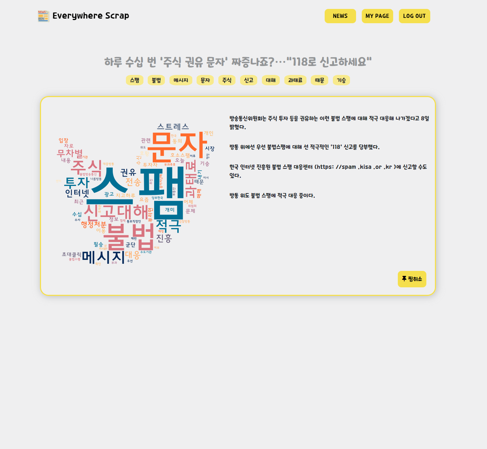

### 💡 참고

* [TextRank 문서요약](https://sungmooncho.com/2012/08/26/pagerank/)
* [TextRank 알고리즘](https://excelsior-cjh.tistory.com/93)